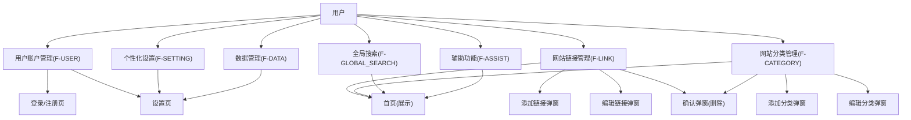
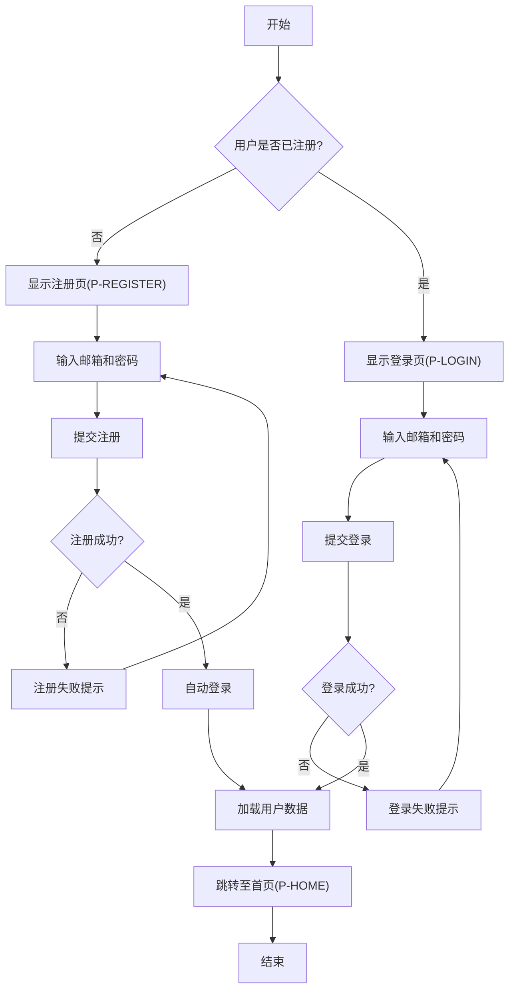
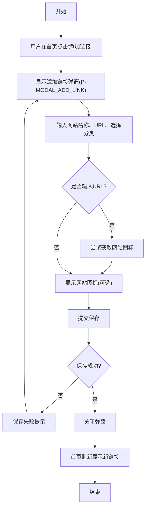
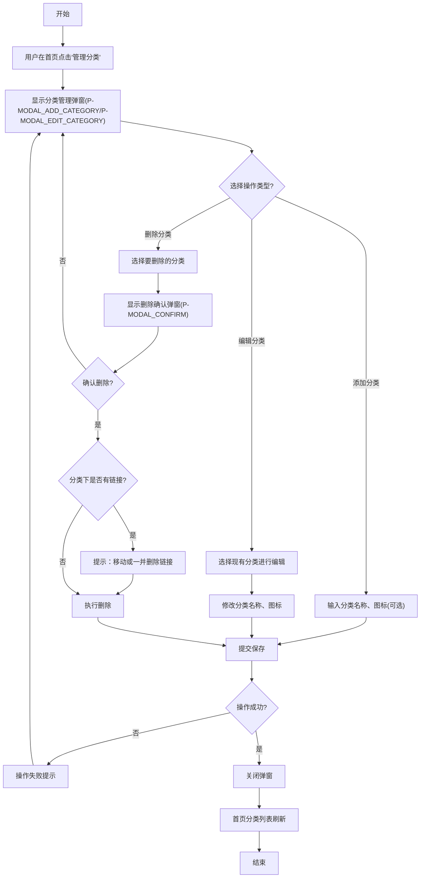
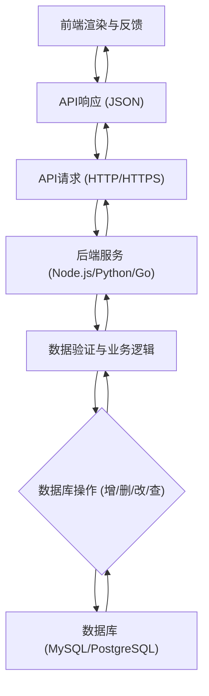

# 酷站导航Web产品需求文档

## 1. 产品概述

### 1.1 产品名称与定位

*   **产品名称:** 酷站导航
*   **产品定位:** 一款面向个人用户的、简洁美观、高效便捷的Web端个性化网站导航工具。旨在帮助用户快速访问和管理常用网站，提升工作和学习效率。

### 1.2 产品应用语言

*   **产品应用语言:** 本产品主要面向中文用户群体，所有界面元素、提示信息和内容均采用简体中文。

### 1.3 产品愿景与目标

*   **产品愿景:** 成为个人用户专属的数字生活入口，让每一次上网都从一个美观、高效、个性化的起点开始。
*   **产品目标:**
    *   提供流畅的用户体验，确保网站访问和管理操作的快捷性。
    *   实现高度个性化定制，满足用户对界面和功能的独特偏好。
    *   打造稳定可靠的产品，保障用户数据安全和访问稳定。
    *   提升个人用户在工作和学习场景下的上网效率。

### 1.4 产品使用终端

*   **主要终端:** Web端桌面应用
*   **浏览器支持:** Chrome 90+、Firefox 88+、Safari 14+、Edge 90+。确保在主流浏览器上提供一致的用户体验。
*   **分辨率支持:** 768x480及以上分辨率，最佳体验为1920x1080。
*   **响应式适配:** 支持768px以上的所有桌面和平板设备，提供桌面端友好的响应式布局。

### 1.5 核心价值主张

*   **高效管理:** 简单直观的界面，实现网站链接的快速添加、分类、搜索和编辑，告别繁琐的浏览器收藏夹。
*   **个性定制:** 提供多样化的主题、背景和布局选项，用户可以根据个人喜好打造专属导航页。
*   **简洁美观:** 专注于核心功能，无冗余信息和广告干扰，提供纯净的视觉体验。
*   **数据同步:** 用户数据云端存储，多设备登录后自动同步，随时随地访问个人导航。

### 1.6 目标用户群体分析

*   **目标用户:** 个人用户，特别是学生、职场人士、自由职业者等。
*   **用户特征:**
    *   **对网站收藏管理有需求:** 经常访问特定网站，希望有一个集中、有序的方式管理这些链接。
    *   **追求界面简洁美观:** 不喜欢传统导航站的繁杂广告，偏爱清晰、无干扰的界面。
    *   **注重效率:** 希望通过快速访问和搜索功能，节省寻找网站的时间。
    *   **乐于个性化定制:** 希望自己的工作学习环境能够体现个人风格。

### 1.7 市场需求与竞品简析

*   **市场需求:** 尽管浏览器收藏夹是普遍的网站管理方式，但其组织性和可访问性有限。传统导航网站（如Hao123）内容庞杂且广告多，难以满足个人定制和简洁的需求。市场上存在一些浏览器新标签页插件或小型导航工具，但多功能性与简洁性之间往往难以平衡。
*   **竞品简析:**
    *   **浏览器自带收藏夹/书签:** 优势是原生集成，但缺点是管理不便，不支持个性化展示。
    *   **传统导航网站 (如Hao123):** 优势是内容丰富，但缺点是广告多、界面杂乱，缺乏个性化。
    *   **浏览器新标签页插件 (如Infinity New Tab):** 优势是功能强大，个性化程度高，但可能功能过于复杂，且需要安装插件。
*   **本产品优势:** 酷站导航定位于Web端独立应用，无需安装插件，通过简洁、美观和高度个性化的特点，满足用户对高效、纯净导航体验的需求，弥补了现有解决方案的不足。

### 1.8 浏览器兼容性要求

*   **兼容范围:** 确保在以下主流桌面浏览器最新稳定版本中正常运行：
    *   Google Chrome (90及以上版本)
    *   Mozilla Firefox (88及以上版本)
    *   Apple Safari (14及以上版本)
    *   Microsoft Edge (90及以上版本)
*   **兼容性标准:** 页面布局、功能交互、数据显示等应在不同浏览器中保持一致性。

## 2. 功能规格

### 2.1 功能详述

### 2.1.1 用户账户管理

| 功能ID | 功能名称 | 功能描述 | 优先级 |
|---|---|---|---|
| F-USER_001 | 用户注册 | 用户可通过邮箱和密码进行注册，注册成功后自动登录并跳转至首页。 | P0 |
| F-USER_002 | 用户登录 | 用户可通过已注册的邮箱和密码登录，支持记住密码功能。 | P0 |
| F-USER_003 | 用户登出 | 用户可随时从系统中登出，登出后跳转至登录页。 | P0 |
| F-USER_004 | 忘记密码 | 用户可通过注册邮箱进行密码重置操作。 | P1 |
| F-USER_005 | 个人资料修改 | 用户可在设置页修改用户名、头像等个人信息。 | P1 |

### 2.1.2 网站链接管理

| 功能ID | 功能名称 | 功能描述 | 优先级 |
|---|---|---|---|
| F-LINK_001 | 添加网站链接 | 用户可通过弹窗输入网站名称、URL、图标（可选）和所属分类来添加新的网站链接。 | P0 |
| F-LINK_002 | 编辑网站链接 | 用户可对已添加的网站链接进行名称、URL、图标和所属分类的修改。 | P0 |
| F-LINK_003 | 删除网站链接 | 用户可删除单个或批量删除网站链接，删除前需进行二次确认。 | P0 |
| F-LINK_004 | 网站链接排序 | 用户可在首页通过拖拽方式调整网站链接在当前分类下的显示顺序。 | P0 |
| F-LINK_005 | 网站链接点击 | 点击网站链接后，在新标签页中打开对应网址。 | P0 |
| F-LINK_006 | 网站链接搜索 | 用户可在首页搜索框输入关键词，快速查找已保存的网站链接。 | P0 |
| F-LINK_007 | 网站图标自动识别 | 当用户输入网站URL时，系统尝试自动抓取并显示网站Favicon作为图标。 | P1 |

### 2.1.3 网站分类管理

| 功能ID | 功能名称 | 功能描述 | 优先级 |
|---|---|---|---|
| F-CATEGORY_001 | 添加分类 | 用户可通过弹窗输入分类名称和图标（可选）来添加新的网站分类。 | P0 |
| F-CATEGORY_002 | 编辑分类 | 用户可对已添加的分类进行名称和图标的修改。 | P0 |
| F-CATEGORY_003 | 删除分类 | 用户可删除分类，删除前需进行二次确认。若分类下有网站链接，需提示用户选择是否将链接移动到其他分类或一并删除。 | P0 |
| F-CATEGORY_004 | 分类排序 | 用户可在首页侧边栏通过拖拽方式调整分类的显示顺序。 | P0 |
| F-CATEGORY_005 | 分类切换 | 用户可点击侧边栏分类名称，切换显示该分类下的网站链接。 | P0 |

### 2.1.4 个性化设置

| 功能ID | 功能名称 | 功能描述 | 优先级 |
|---|---|---|---|
| F-SETTING_001 | 背景设置 | 用户可选择系统预设背景图或上传自定义图片作为首页背景。 | P1 |
| F-SETTING_002 | 主题切换 | 用户可选择亮色/暗色主题，或系统提供其他预设主题。 | P1 |
| F-SETTING_003 | 布局调整 | 用户可选择网站链接的显示布局，如宫格布局、列表布局等。 | P1 |
| F-SETTING_004 | 搜索框配置 | 用户可配置首页搜索框的默认搜索引擎（如百度、Google等）。 | P1 |

### 2.1.5 数据管理

| 功能ID | 功能名称 | 功能描述 | 优先级 |
|---|---|---|---|
| F-DATA_001 | 数据导入 | 用户可导入浏览器书签或特定格式的网站链接数据。 | P1 |
| F-DATA_002 | 数据导出 | 用户可将当前所有网站链接和分类数据导出为特定格式文件。 | P1 |

### 2.1.6 搜索功能

| 功能ID | 功能名称 | 功能描述 | 优先级 |
|---|---|---|---|
| F-GLOBAL_SEARCH_001 | 全局搜索 | 首页提供统一搜索框，用户输入内容后，可选择进行站内链接搜索或外部搜索引擎搜索。 | P0 |

### 2.1.7 辅助功能

| 功能ID | 功能名称 | 功能描述 | 优先级 |
|---|---|---|---|
| F-ASSIST_001 | 常用网站区 | 首页顶部或特定区域可设置常用网站快捷入口，支持自定义和拖拽排序。 | P1 |

### 2.2 功能模块间的关系图

## 3. 用户流程

### 3.1 用户旅程地图

| 阶段 | 用户行为 | 情绪 | 痛点 | 酷站导航如何解决 |
|---|---|---|---|---|
| **发现与注册** | 寻找高效导航工具，注册账户 | 期待，谨慎 | 现有工具复杂或广告多 | 简洁UI，快速注册流程 |
| **首次使用** | 登录，浏览首页，尝试添加链接 | 新奇，摸索 | 不知如何开始，无内容 | 清晰的新手引导，便捷添加入口 |
| **日常使用** | 访问网站，管理链接和分类 | 愉悦，高效 | 查找网站耗时，收藏夹混乱 | 快速搜索，分类导航，拖拽排序 |
| **个性化** | 调整主题背景，布局设置 | 满足，创造 | 界面单调，缺乏个性 | 多样化主题/背景，灵活布局选项 |
| **数据管理** | 导入导出数据，修改个人信息 | 安心，信任 | 数据丢失风险，迁移不便 | 提供数据备份/恢复，账户安全 |
| **问题与反馈** | 遇到问题，寻求帮助 | 困惑，沮丧 | 问题无处反馈，无人响应 | 清晰的帮助文档，用户反馈渠道 |

### 3.2 关键业务流程图

### 3.2.1 用户注册与登录流程

### 3.2.2 添加网站链接流程

### 3.2.3 管理分类流程

### 3.3 各场景下的用户操作步骤

#### 3.3.1 首次注册并添加一个网站

1.  **访问产品:** 用户在浏览器中输入产品网址。
2.  **进入注册页:** 点击登录页上的“注册”按钮。
3.  **填写注册信息:** 在注册页（P-REGISTER）填写邮箱和密码。
4.  **提交注册:** 点击“注册”按钮。
5.  **自动登录并进入首页:** 系统自动登录并跳转到首页（P-HOME）。
6.  **点击添加链接:** 在首页点击“添加链接”按钮。
7.  **填写链接信息:** 在添加链接弹窗（P-MODAL_ADD_LINK）中输入网站名称、URL，并选择默认分类。
8.  **保存链接:** 点击弹窗中的“保存”按钮。
9.  **查看新链接:** 弹窗关闭，首页内容区域刷新，显示新添加的网站链接。

#### 3.3.2 切换分类和调整网站排序

1.  **登录系统:** 用户在登录页（P-LOGIN）输入邮箱和密码并登录，进入首页（P-HOME）。
2.  **切换分类:** 在首页左侧菜单点击不同的分类名称。
3.  **查看对应链接:** 主内容区显示对应分类下的所有网站链接。
4.  **拖拽排序:** 鼠标按住某个网站链接图标，拖拽到目标位置。
5.  **释放鼠标:** 释放鼠标后，网站链接在当前分类下的顺序更新。

#### 3.3.3 修改个性化设置

1.  **登录系统:** 用户在登录页（P-LOGIN）输入邮箱和密码并登录，进入首页（P-HOME）。
2.  **进入设置页:** 在顶部导航栏或左侧菜单点击“设置”入口，跳转至设置页（P-SETTINGS）。
3.  **选择设置项:** 在设置页中选择“背景设置”。
4.  **选择新背景:** 点击选择系统预设背景图或上传自定义图片。
5.  **保存设置:** 点击“保存”按钮。
6.  **返回首页:** 点击“返回首页”按钮，首页背景更新为新设置。

## 4. 数据流设计

### 4.1 数据结构与关系

*   **用户 (User):** 存储用户基本信息，是所有其他数据的主体。
    *   `id` (int, Primary Key)
    *   `email` (string, Unique)
    *   `password_hash` (string)
    *   `username` (string)
    *   `avatar_url` (string, Optional)
    *   `created_at` (datetime)
    *   `updated_at` (datetime)
*   **分类 (Category):** 存储用户自定义的网站分类。每个分类属于一个用户。
    *   `id` (int, Primary Key)
    *   `user_id` (int, Foreign Key to User.id)
    *   `name` (string)
    *   `icon_url` (string, Optional)
    *   `order_index` (int) - 用于分类排序
    *   `created_at` (datetime)
    *   `updated_at` (datetime)
*   **网站链接 (Link):** 存储用户收藏的网站链接。每个链接属于一个分类。
    *   `id` (int, Primary Key)
    *   `category_id` (int, Foreign Key to Category.id)
    *   `name` (string)
    *   `url` (string)
    *   `icon_url` (string, Optional) - 网站Favicon
    *   `order_index` (int) - 用于链接排序
    *   `created_at` (datetime)
    *   `updated_at` (datetime)
*   **用户设置 (UserSetting):** 存储用户的个性化设置。每个用户有一个设置记录。
    *   `id` (int, Primary Key)
    *   `user_id` (int, Unique, Foreign Key to User.id)
    *   `background_image_url` (string, Optional)
    *   `theme_mode` (string, e.g., 'light', 'dark')
    *   `layout_type` (string, e.g., 'grid', 'list')
    *   `default_search_engine` (string, e.g., 'baidu', 'google')
    *   `created_at` (datetime)
    *   `updated_at` (datetime)

### 4.2 关键数据流向图

### 4.3 数据存储与处理原则

1.  **数据安全:**
    *   用户密码采用加盐哈希存储，禁止明文存储。
    *   所有敏感数据传输均通过HTTPS加密。
    *   严格控制数据库访问权限，定期进行安全审计。
2.  **数据一致性:**
    *   通过事务管理确保关键业务操作（如删除分类及其下链接）的数据一致性。
    *   乐观锁或悲观锁机制处理并发修改。
3.  **数据持久化:**
    *   所有用户生成的数据（账户、链接、分类、设置）均持久化存储于数据库中。
    *   定期进行数据库备份，确保数据可恢复性。
4.  **数据同步:**
    *   用户登录后，所有数据从服务端同步至客户端。
    *   用户在任一设备上的修改，应实时或准实时同步至服务器，并更新其他登录设备。
5.  **数据隔离:**
    *   每个用户的数据严格隔离，确保用户只能访问和管理自己的数据。

## 5. 页面规格

### 5.1 页面概览

#### 5.1.1 整体布局架构

*   **布局模式:** Web端响应式布局 - 顶部导航栏 + 主内容区(最小720px) + 可选左侧菜单(200-240px/48-56px)
*   **空间分配策略:**
    *   大屏幕(≥1440px): 顶部60px + 左侧240px(固定展开) + 主内容区(动态)
    *   中屏幕(1200-1439px): 顶部60px + 左侧200px(固定展开) + 主内容区(充满剩余空间)
    *   小屏幕(768-1199px): 顶部60px + 左侧菜单(折叠或抽屉式) + 主内容区(充满)
*   **导航体系:** 顶部主导航 + 左侧功能菜单 + 面包屑导航(仅在设置页等层级较深页面使用)
*   **交互模式:** 页面切换 + 模态弹窗 + 抽屉式菜单
*   **右侧面板使用:** 本产品为追求“简洁”，**严格不使用右侧面板**。所有辅助信息或功能均整合到主内容区、弹窗或抽屉中。

#### 5.1.2 页面列表

| 页面ID | 页面名称 | 核心功能 | 布局类型 | 右侧面板 |
|---|---|---|---|---|
| P-LOGIN | 登录页 | 用户登录 | 单栏居中 | 不使用 |
| P-REGISTER | 注册页 | 用户注册 | 单栏居中 | 不使用 |
| P-FORGOT_PASSWORD | 忘记密码页 | 重置用户密码 | 单栏居中 | 不使用 |
| P-HOME | 首页 | 网站链接展示与管理、分类切换、搜索 | 顶部导航+左侧菜单+主内容区 | 不使用 |
| P-SETTINGS | 设置页 | 账户管理、个性化设置、数据导入导出 | 顶部导航+左侧菜单+主内容区 | 不使用 |
| P-MODAL_ADD_LINK | 添加链接弹窗 | 添加新的网站链接 | 模态弹窗 | 不使用 |
| P-MODAL_EDIT_LINK | 编辑链接弹窗 | 修改现有网站链接信息 | 模态弹窗 | 不使用 |
| P-MODAL_ADD_CATEGORY | 添加分类弹窗 | 添加新的网站分类 | 模态弹窗 | 不使用 |
| P-MODAL_EDIT_CATEGORY | 编辑分类弹窗 | 修改现有网站分类信息 | 模态弹窗 | 不使用 |
| P-MODAL_CONFIRM | 确认弹窗 | 敏感操作的二次确认 | 模态弹窗 | 不使用 |

### 5.2 页面详情

#### 5.2.1 登录页（P-LOGIN）

**布局架构设计：**
- 页面类型：表单页
- 布局模式：单栏居中布局
- 空间分配：页面主体居中显示，两侧留白，顶部可包含Logo或产品名称。

**页面布局架构：**
- 顶部区域：产品Logo及名称 - 建议高度80px
- 主内容区域：登录表单卡片 - 建议宽度360-400px，居中显示
  - 表单头部：标题“用户登录”
  - 登录表单：包含邮箱输入框、密码输入框、记住密码复选框
  - 登录按钮：提交登录操作
  - 辅助链接：注册、忘记密码
- 底部区域：版权信息等 - 建议高度40px

**响应式适配策略：**
- 大屏幕(≥1440px)：单栏居中，表单卡片宽度保持360-400px。
- 中屏幕(1200-1439px)：单栏居中，表单卡片宽度保持360-400px。
- 小屏幕(768-1199px)：单栏居中，表单卡片宽度自适应，最大宽度90%。
- 移动端(<768px)：单栏布局，表单元素垂直堆叠，宽度适应屏幕，间距适当增大。

**组件尺寸规范：**
- 按钮尺寸：主要按钮高度40px，宽度自适应。
- 输入框：高度40px，宽度充满父容器。
- 间距规范：表单项之间16-24px，按钮与链接之间12px。

**核心功能：**
用户登录（F-USER_002），提供注册和忘记密码入口。

**交互设计：**
- 鼠标交互：输入框聚焦高亮，按钮悬停效果。
- 键盘交互：Tab键切换焦点，Enter键提交登录。
- 状态管理：记住密码状态通过LocalStorage或Cookie保持。

**页面间跳转关系：**
| 触发组件 | 交互类型 | 目标页面 | 传递参数 | 展示方式 |
|---|---|---|---|---|
| 登录成功 | 自动跳转 | 首页（P-HOME） | 用户Token | 整页跳转 |
| 注册按钮 | 点击 | 注册页（P-REGISTER） | 无 | 整页跳转 |
| 忘记密码链接 | 点击 | 忘记密码页（P-FORGOT_PASSWORD） | 无 | 整页跳转 |

#### 5.2.2 注册页（P-REGISTER）

**布局架构设计：**
- 页面类型：表单页
- 布局模式：单栏居中布局
- 空间分配：与登录页类似，页面主体居中显示。

**页面布局架构：**
- 顶部区域：产品Logo及名称 - 建议高度80px
- 主内容区域：注册表单卡片 - 建议宽度360-400px，居中显示
  - 表单头部：标题“用户注册”
  - 注册表单：包含邮箱输入框、密码输入框、确认密码输入框
  - 注册按钮：提交注册操作
  - 辅助链接：已有账户？去登录
- 底部区域：版权信息等 - 建议高度40px

**响应式适配策略：**
- 与登录页（P-LOGIN）一致。

**组件尺寸规范：**
- 与登录页（P-LOGIN）一致。

**核心功能：**
用户注册（F-USER_001），提供登录入口。

**交互设计：**
- 鼠标交互：输入框聚焦高亮，按钮悬停效果。
- 键盘交互：Tab键切换焦点，Enter键提交注册。
- 状态管理：无。

**页面间跳转关系：**
| 触发组件 | 交互类型 | 目标页面 | 传递参数 | 展示方式 |
|---|---|---|---|---|
| 注册成功 | 自动跳转 | 首页（P-HOME） | 用户Token | 整页跳转 |
| 去登录链接 | 点击 | 登录页（P-LOGIN） | 无 | 整页跳转 |

#### 5.2.3 忘记密码页（P-FORGOT_PASSWORD）

**布局架构设计：**
- 页面类型：表单页
- 布局模式：单栏居中布局
- 空间分配：与登录页类似，页面主体居中显示。

**页面布局架构：**
- 顶部区域：产品Logo及名称 - 建议高度80px
- 主内容区域：忘记密码表单卡片 - 建议宽度360-400px，居中显示
  - 表单头部：标题“忘记密码”
  - 表单：包含注册邮箱输入框
  - 提交按钮：发送重置链接到邮箱
  - 辅助链接：返回登录
- 底部区域：版权信息等 - 建议高度40px

**响应式适配策略：**
- 与登录页（P-LOGIN）一致。

**组件尺寸规范：**
- 与登录页（P-LOGIN）一致。

**核心功能：**
用户忘记密码（F-USER_004），提供返回登录入口。

**交互设计：**
- 鼠标交互：输入框聚焦高亮，按钮悬停效果。
- 键盘交互：Tab键切换焦点，Enter键提交。
- 状态管理：无。

**页面间跳转关系：**
| 触发组件 | 交互类型 | 目标页面 | 传递参数 | 展示方式 |
|---|---|---|---|---|
| 返回登录链接 | 点击 | 登录页（P-LOGIN） | 无 | 整页跳转 |

#### 5.2.4 首页（P-HOME）

**布局架构设计：**
- 页面类型：列表页，包含核心内容展示和导航功能
- 布局模式：顶部导航 + 左侧菜单 + 主内容区
- 空间分配：顶部导航固定60px高，左侧菜单固定宽度（展开时240px），主内容区占据剩余空间，最小宽度720px。

**页面布局架构：**
- 顶部导航栏：Logo、产品名称、全局搜索框（F-GLOBAL_SEARCH_001）、用户头像（点击可弹出操作菜单：设置、退出） - 建议高度60px，固定定位
- 左侧菜单：网站分类列表（F-CATEGORY_005），可拖拽排序（F-CATEGORY_004），下方包含“添加分类”按钮（F-CATEGORY_001）和“管理分类”按钮（用于编辑/删除分类 F-CATEGORY_002/F-CATEGORY_003）。左侧菜单建议宽度240px(展开)/56px(折叠)。
- 主内容区域：核心展示区域，建议最小宽度720px
  - 页面头部：当前分类名称、面包屑导航（当有次级分类时）、“添加链接”按钮（F-LINK_001）
  - 常用网站区：用户自定义的常用网站快捷入口（F-ASSIST_001），支持拖拽排序。
  - 内容展示区域：当前分类下的网站链接列表，以宫格布局（F-SETTING_003）展示，每个链接包含图标、名称，支持拖拽排序（F-LINK_004）。
  - 无数据提示：当分类下无链接时，显示提示信息及引导添加链接的按钮。

**响应式适配策略：**
- 大屏幕(≥1440px)：二栏布局，左侧菜单展开240px，主内容区宽度动态调整。
- 中屏幕(1200-1439px)：二栏布局，左侧菜单展开200px，主内容区充满剩余空间。
- 小屏幕(768-1199px)：左侧菜单默认折叠为56px，鼠标悬停或点击后展开为抽屉式200px，主内容区充满。网站链接可调整为2列布局。
- 移动端(<768px)：单栏布局，左侧菜单隐藏，通过顶部汉堡菜单或底部导航（若有）触发抽屉式显示。网站链接单列显示。

**组件尺寸规范：**
- 按钮尺寸：主要操作按钮40px高度，次要按钮32px高度。
- 输入框：搜索框40px高度。
- 网站链接卡片：建议宽度120-160px，高度80-100px，图标48px。
- 列表行高：左侧分类菜单项行高44px。
- 图标尺寸：导航图标20px，操作图标16px。
- 间距规范：卡片间距16-24px，区域间距20-32px，组件内间距12px。

**核心功能：**
网站链接的展示、点击访问（F-LINK_005）、添加（F-LINK_001）、编辑（P-MODAL_EDIT_LINK）、删除（P-MODAL_CONFIRM），网站链接排序（F-LINK_004），分类切换（F-CATEGORY_005），全局搜索（F-GLOBAL_SEARCH_001），常用网站区（F-ASSIST_001）。

**数据结构：**(内容展示区域-网站链接列表)
| 列名 | 数据类型 | 宽度建议 | 是否可排序 | 操作功能 |
|---|---|---|---|---|
| 图标 | 图片URL | 48px | 否 | 无 |
| 网站名称 | 文本+链接 | 100-140px | 是（按字母） | 点击打开链接 |
| URL | 文本 | 隐藏 | 否 | 右键复制 |
| 操作 | 按钮组 | 80px | 否 | 编辑、删除 |

**交互设计：**
- 鼠标交互：网站链接卡片悬停显示编辑/删除按钮；拖拽网站链接和分类进行排序。
- 键盘交互：Tab键导航，Enter键打开链接，ESC键关闭弹窗。
- 状态管理：当前分类、搜索关键词、排序状态保持。

**页面间跳转关系：**
| 触发组件 | 交互类型 | 目标页面 | 传递参数 | 展示方式 |
|---|---|---|---|---|
| 顶部用户头像 | 点击 | 设置页（P-SETTINGS） | 无 | 主内容区切换 |
| 顶部用户头像 | 点击 | 登录页（P-LOGIN） | 无 | 整页跳转 (登出) |
| 左侧分类名称 | 点击 | 首页（P-HOME） | categoryId | 主内容区刷新 |
| 添加链接按钮 | 点击 | 添加链接弹窗（P-MODAL_ADD_LINK） | currentCategoryId | 模态弹窗 |
| 网站链接卡片 | 点击 | 外部网站 | URL | 新标签页打开 |
| 网站链接编辑按钮 | 点击 | 编辑链接弹窗（P-MODAL_EDIT_LINK） | linkId | 模态弹窗 |
| 网站链接删除按钮 | 点击 | 确认弹窗（P-MODAL_CONFIRM） | linkId | 模态弹窗 |
| 添加分类按钮 | 点击 | 添加分类弹窗（P-MODAL_ADD_CATEGORY） | 无 | 模态弹窗 |
| 管理分类按钮 | 点击 | 编辑分类弹窗（P-MODAL_EDIT_CATEGORY） | 无 | 模态弹窗 |

#### 5.2.5 设置页（P-SETTINGS）

**布局架构设计：**
- 页面类型：表单页/配置页
- 布局模式：顶部导航 + 左侧菜单 + 主内容区
- 空间分配：与首页（P-HOME）类似，主内容区承载设置项。

**页面布局架构：**
- 顶部导航栏：与首页（P-HOME）一致
- 左侧菜单：固定为56px（折叠状态），点击可展开为200px，显示设置项列表（如：账户设置、外观设置、数据管理、关于）。
- 主内容区域：核心设置区域，建议最小宽度720px
  - 页面头部：当前设置项标题、面包屑导航（可选）
  - 设置表单/区域：根据左侧菜单选择的设置项，显示对应的配置表单或操作区。
    - **账户设置:** 包含用户名、头像修改（F-USER_005），密码修改（F-USER_004入口）。
    - **外观设置:** 包含背景设置（F-SETTING_001）、主题切换（F-SETTING_002）、布局调整（F-SETTING_003）。
    - **数据管理:** 包含数据导入（F-DATA_001）、数据导出（F-DATA_002）按钮。
    - **关于:** 产品版本信息、帮助文档链接等。
  - 底部操作区：保存设置按钮（如适用），返回按钮。

**响应式适配策略：**
- 大屏幕(≥1440px)：二栏布局，左侧菜单展开200px，主内容区宽度动态调整。
- 中屏幕(1200-1439px)：二栏布局，左侧菜单展开200px，主内容区充满剩余空间。
- 小屏幕(768-1199px)：左侧菜单默认折叠为56px，鼠标悬停或点击后展开为抽屉式200px，主内容区充满。设置项垂直堆叠。
- 移动端(<768px)：单栏布局，左侧菜单隐藏，通过顶部汉堡菜单触发抽屉式显示。设置项单列显示。

**组件尺寸规范：**
- 按钮尺寸：主要操作按钮40px高度，次要按钮32px高度。
- 输入框：32-40px高度。
- 间距规范：表单项之间16-24px，区域之间24-32px。

**核心功能：**
个人资料修改（F-USER_005），背景设置（F-SETTING_001），主题切换（F-SETTING_002），布局调整（F-SETTING_003），搜索框配置（F-SETTING_004），数据导入（F-DATA_001），数据导出（F-DATA_002）。

**交互设计：**
- 鼠标交互：表单项聚焦高亮，按钮悬停效果。
- 键盘交互：Tab键切换焦点，Enter键提交表单。
- 状态管理：设置项修改后需点击保存按钮方可生效，未保存离开页面时提示用户。

**页面间跳转关系：**
| 触发组件 | 交互类型 | 目标页面 | 传递参数 | 展示方式 |
|---|---|---|---|---|
| 左侧菜单项 | 点击 | 设置页（P-SETTINGS） | settingType | 主内容区切换 |
| 保存按钮 | 点击 | 设置页（P-SETTINGS） | 无 | 页面内容刷新 |
| 返回首页按钮 | 点击 | 首页（P-HOME） | 无 | 主内容区切换 |

#### 5.2.6 添加链接弹窗（P-MODAL_ADD_LINK）

**布局架构设计：**
- 页面类型：表单页
- 布局模式：模态弹窗
- 空间分配：弹窗居中显示，覆盖主内容区，弹窗内部为表单。

**页面布局架构：**
- 弹窗标题：添加网站链接
- 弹窗内容区：
  - 表单项：网站名称（必填）、URL（必填，F-LINK_007自动识别图标）、所属分类（下拉选择，默认当前分类）、图标（可选，可手动上传或选择系统图标）
  - 提示信息：URL输入时自动获取Favicon的提示。
- 弹窗底部：取消按钮、保存按钮

**响应式适配策略：**
- 大屏幕(≥1440px)：弹窗宽度500px，居中。
- 中屏幕(1200-1439px)：弹窗宽度500px，居中。
- 小屏幕(768-1199px)：弹窗宽度80%屏幕宽度，居中。
- 移动端(<768px)：弹窗全屏或接近全屏显示，表单元素垂直堆叠。

**组件尺寸规范：**
- 按钮尺寸：36px高度。
- 输入框：36px高度。
- 下拉选择框：36px高度。

**核心功能：**
添加网站链接（F-LINK_001），网站图标自动识别（F-LINK_007）。

**交互设计：**
- 鼠标交互：输入框聚焦高亮，按钮悬停效果，下拉选择。
- 键盘交互：Tab键切换焦点，Enter键提交，Esc键关闭弹窗。
- 状态管理：表单填写过程中，URL输入后尝试获取图标。

**页面间跳转关系：**
| 触发组件 | 交互类型 | 目标页面 | 传递参数 | 展示方式 |
|---|---|---|---|---|
| 保存按钮 | 点击 | 首页（P-HOME） | 无 | 关闭弹窗，刷新主内容区 |
| 取消按钮/Esc键 | 点击/键盘 | 首页（P-HOME） | 无 | 关闭弹窗 |

#### 5.2.7 编辑链接弹窗（P-MODAL_EDIT_LINK）

**布局架构设计：**
- 页面类型：表单页
- 布局模式：模态弹窗
- 空间分配：与添加链接弹窗（P-MODAL_ADD_LINK）一致。

**页面布局架构：**
- 弹窗标题：编辑网站链接
- 弹窗内容区：
  - 表单项：网站名称（必填）、URL（必填）、所属分类（下拉选择）、图标（可选）
  - 提示信息：URL输入时自动获取Favicon的提示。
- 弹窗底部：取消按钮、保存按钮

**响应式适配策略：**
- 与添加链接弹窗（P-MODAL_ADD_LINK）一致。

**组件尺寸规范：**
- 与添加链接弹窗（P-MODAL_ADD_LINK）一致。

**核心功能：**
编辑网站链接（F-LINK_002）。

**交互设计：**
- 与添加链接弹窗（P-MODAL_ADD_LINK）一致。

**页面间跳转关系：**
| 触发组件 | 交互类型 | 目标页面 | 传递参数 | 展示方式 |
|---|---|---|---|---|
| 保存按钮 | 点击 | 首页（P-HOME） | 无 | 关闭弹窗，刷新主内容区 |
| 取消按钮/Esc键 | 点击/键盘 | 首页（P-HOME） | 无 | 关闭弹窗 |

#### 5.2.8 添加分类弹窗（P-MODAL_ADD_CATEGORY）

**布局架构设计：**
- 页面类型：表单页
- 布局模式：模态弹窗
- 空间分配：弹窗居中显示，覆盖主内容区，弹窗内部为表单。

**页面布局架构：**
- 弹窗标题：添加分类
- 弹窗内容区：
  - 表单项：分类名称（必填）、图标（可选，可选择系统预设图标）
- 弹窗底部：取消按钮、保存按钮

**响应式适配策略：**
- 与添加链接弹窗（P-MODAL_ADD_LINK）一致。

**组件尺寸规范：**
- 与添加链接弹窗（P-MODAL_ADD_LINK）一致。

**核心功能：**
添加分类（F-CATEGORY_001）。

**交互设计：**
- 鼠标交互：输入框聚焦高亮，按钮悬停效果。
- 键盘交互：Tab键切换焦点，Enter键提交，Esc键关闭弹窗。

**页面间跳转关系：**
| 触发组件 | 交互类型 | 目标页面 | 传递参数 | 展示方式 |
|---|---|---|---|---|
| 保存按钮 | 点击 | 首页（P-HOME） | 无 | 关闭弹窗，刷新左侧菜单 |
| 取消按钮/Esc键 | 点击/键盘 | 首页（P-HOME） | 无 | 关闭弹窗 |

#### 5.2.9 编辑分类弹窗（P-MODAL_EDIT_CATEGORY）

**布局架构设计：**
- 页面类型：表单页/列表管理
- 布局模式：模态弹窗
- 空间分配：弹窗居中显示，覆盖主内容区，弹窗内部为分类列表和编辑表单。

**页面布局架构：**
- 弹窗标题：管理分类
- 弹窗内容区：
  - 分类列表：展示所有分类，每项包含分类名称、编辑按钮、删除按钮。
  - 编辑表单（可展开）：点击编辑按钮后，显示当前分类的名称、图标编辑表单。
- 弹窗底部：关闭按钮

**响应式适配策略：**
- 与添加链接弹窗（P-MODAL_ADD_LINK）一致。

**组件尺寸规范：**
- 与添加链接弹窗（P-MODAL_ADD_LINK）一致。

**核心功能：**
编辑分类（F-CATEGORY_002），删除分类（F-CATEGORY_003）。

**交互设计：**
- 鼠标交互：列表项悬停效果，编辑/删除按钮点击。
- 键盘交互：Tab键切换焦点，Esc键关闭弹窗。

**页面间跳转关系：**
| 触发组件 | 交互类型 | 目标页面 | 传递参数 | 展示方式 |
|---|---|---|---|---|
| 删除分类按钮 | 点击 | 确认弹窗（P-MODAL_CONFIRM） | categoryId | 模态弹窗 |
| 关闭按钮/Esc键 | 点击/键盘 | 首页（P-HOME） | 无 | 关闭弹窗，刷新左侧菜单 |

#### 5.2.10 确认弹窗（P-MODAL_CONFIRM）

**布局架构设计：**
- 页面类型：提示页
- 布局模式：模态弹窗
- 空间分配：弹窗居中显示，覆盖主内容区，弹窗内部为提示信息和操作按钮。

**页面布局架构：**
- 弹窗标题：操作确认
- 弹窗内容区：
  - 提示信息：例如“确定删除该网站链接吗？”、“该分类下有网站链接，确定一并删除吗？”（F-CATEGORY_003）
- 弹窗底部：取消按钮、确认按钮

**响应式适配策略：**
- 弹窗宽度300-400px，居中显示，小屏幕下宽度自适应。

**组件尺寸规范：**
- 按钮尺寸：36px高度。

**核心功能：**
敏感操作的二次确认。

**交互设计：**
- 鼠标交互：按钮悬停效果。
- 键盘交互：Tab键切换焦点，Enter键确认，Esc键取消。

**页面间跳转关系：**
| 触发组件 | 交互类型 | 目标页面 | 传递参数 | 展示方式 |
|---|---|---|---|---|
| 确认按钮 | 点击 | 首页（P-HOME） | 无 | 关闭弹窗，刷新主内容区/左侧菜单 |
| 取消按钮/Esc键 | 点击/键盘 | 原页面/弹窗 | 无 | 关闭弹窗 |